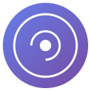

<p align="center">
  
</p>

<h1 align="center">Brain</h1>

<p align="center">
  Capture AI conversations from ChatGPT, Claude, Gemini, and Grok into Obsidian.
</p>

<p align="center">
  
  
  
</p>

---

## Features

- **Multi-Platform Support** - ChatGPT, Claude, Gemini, Grok
- **Auto-Capture** - Saves automatically after AI responds (configurable delay)
- **Manual Capture** - "Capture to Brain" button as fallback
- **Obsidian Integration** - Direct vault writing via Local REST API
- **Graph Connections** - Auto-generates linked notes for Obsidian Graph View
- **Privacy Options** - Exclude URLs, anonymize AI names
- **100% Local** - No data leaves your machine

## Quick Start

### 1. Install Chrome Extension

1. Open Chrome → `chrome://extensions/`
2. Enable **Developer mode**
3. Click **Load unpacked**
4. Select the `Brain` folder

### 2. Install Obsidian Plugin

1. Open Obsidian → Settings → Community plugins → Browse
2. Search **"Local REST API"** → Install → Enable
3. Copy the **API Key** from plugin settings
4. Enable **HTTP server** (port 27123)

### 3. Connect

1. Click Brain icon in Chrome
2. Paste your API Key
3. Port: `27123`
4. Click **Connect** → **Test**

### 4. Capture

1. Go to ChatGPT/Claude/Gemini/Grok
2. Click **"Capture to Brain"** or wait for auto-save
3. Check your Obsidian vault → `AI-Brain/` folder

## Auto-Capture

Brain watches for new messages and saves automatically:

1. Send a message to AI
2. AI responds
3. After your delay (default: 5 seconds) → auto-saves
4. Manual button always available as fallback

### Settings

| Setting | Default | Description |
|---------|---------|-------------|
| Enable auto-capture | On | Toggle automatic saving |
| Delay | 5000ms | Wait time after new message |
| Capture Folder | AI-Brain | Folder name in vault |
| Generate graph | On | Create linked notes |

## Output Format

Saved as Markdown with YAML frontmatter:

```markdown
---
title: "Chat Title"
platform: ChatGPT
captured: 2024-01-15T10:30:00Z
tags:
  - ai-conversation
  - chatgpt
---

# Chat Title

**Platform:** ChatGPT
**Captured:** 1/15/2024, 10:30:00 AM

---

## 👤 You

Your message here

---

## 🤖 ChatGPT

AI response here
```

## Vault Structure

```
YourVault/
└── AI-Brain/
    ├── chatgpt/
    │   └── 2024-01-15-conversation.md
    ├── claude/
    ├── gemini/
    ├── grok/
    └── _graphs/
        └── 2024-01-15-graph.md
```

## Security

- ✅ 100% local - no external servers
- ✅ No analytics or tracking
- ✅ No account required
- ✅ Open source
- ✅ Data only goes to your Obsidian vault

## Troubleshooting

| Issue | Solution |
|-------|----------|
| "Not connected" | Check Obsidian is running, plugin enabled |
| "API error 401" | Wrong API key - copy from plugin settings |
| "Capture failed" | Refresh page, try manual button |
| Auto-capture not working | Check Settings → Enable auto-capture |

## Supported Platforms

| Platform | URL |
|----------|-----|
| ChatGPT | chat.openai.com, chatgpt.com |
| Claude | claude.ai |
| Gemini | gemini.google.com |
| Grok | grok.com, x.com |

## Acknowledgements

This project uses the [Obsidian Local REST API](https://github.com/coddingtonbear/obsidian-local-rest-api) plugin by [@coddingtonbear](https://github.com/coddingtonbear) to connect with Obsidian and write notes directly to your vault.

A huge thank you to the maintainers of this incredible plugin that makes the Obsidian integration possible.
